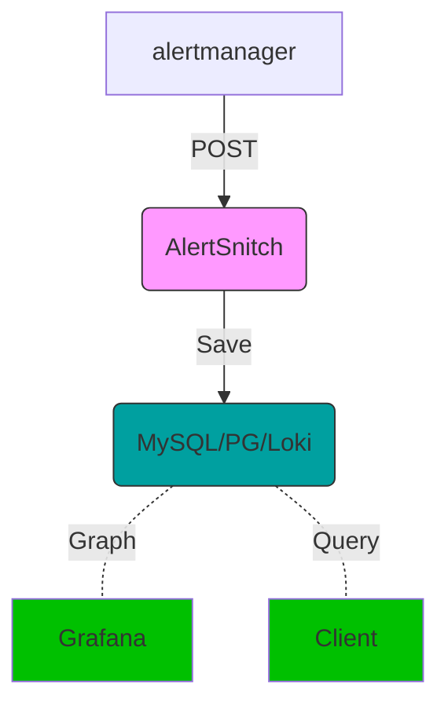

> [!IMPORTANT]
> This project is a fork of [yakshaving.art/alertsnitch](https://gitlab.com/yakshaving.art/alertsnitch) which was last updated in 2020. We've added Loki support while maintaining the original project's spirit of making alert history queryable.

# AlertSnitch

Captures Prometheus AlertManager alerts and writes them in MySQL, Postgres, or Loki 
for future examination.

Because given a noisy enough alerting environment, offline querying
capabilities of triggered alerts are extremely valuable.

## How does it work

1. You stand up one of these however you like (multi-arch Docker images provided)
1. You set up AlertManager to point at it and propagate your alerts.
1. Every alert that gets triggered reaches your database.
1. Profit.



## Local install

Simply install to your $GOPATH using your GO tools

```sh
$ go get github.com/mikehsu0618/alertsnitch
```

## Requirements

To run AlertSnitch requires one of the following backends:
- MySQL database
- Postgres database 
- Loki instance

For MySQL/Postgres, the database must be initialized with the AlertSnitch model.
AlertSnitch will not go online until the model is up to date with the
expected one. Bootstrapping scripts are provided in the [database](./database)
folder.

## Configuration

### MySQL

For specifics about how to set up the MySQL DSN refer to [Go MySQL client driver](https://github.com/go-sql-driver/mysql)

This is a sample of a DSN that would connect to the local host over a Unix socket

```bash
export ALERTSNITCH_BACKEND="mysql"
export ALERTSNITCH_BACKEND_ENDPOINT="${MYSQL_USER}:${MYSQL_PASSWORD}@tcp(${MYSQL_HOST}:${MYSQL_PORT})/${MYSQL_SCHEMA}"
```

### Postgres

```bash
export ALERTSNITCH_BACKEND="postgres"
export ALERTSNITCH_BACKEND_ENDPOINT="sslmode=disable user=${PGUSER} password=${PGPASSWORD} host=${PGHOST} database=${PGDATABASE}"
```

### Loki

```bash
export ALERTSNITCH_BACKEND="loki"
export ALERTSNITCH_BACKEND_ENDPOINT="http://loki:3100"
export ALERTSNITCH_LOKI_TENANT_ID="tenant1"  # Optional
export ALERTSNITCH_LOKI_BASIC_AUTH_USER="user"  # Optional
export ALERTSNITCH_LOKI_BASIC_AUTH_PASSWORD="pass"  # Optional
```

#### TLS Configuration (for HTTPS connections)

**Use client certificate authentication**
```bash
export ALERTSNITCH_LOKI_TLS_INSECURE_SKIP_VERIFY="false"  # Default value
export ALERTSNITCH_LOKI_TLS_CA_CERT_PATH="/path/to/ca-cert.pem"
export ALERTSNITCH_LOKI_TLS_CLIENT_CERT_PATH="/path/to/client-cert.pem"
export ALERTSNITCH_LOKI_TLS_CLIENT_KEY_PATH="/path/to/client-key.pem"
```

## How to run

### Running with Docker

**Run using docker compose**

A docker-compose.yml file is provided with support for both MySQL and Loki backends:

```bash
# For MySQL backend
docker-compose --profile mysql up

# For Loki backend
docker-compose --profile loki up
```

### Running Manually

1. Open a terminal and run the following
2. Copy the AlertSnitch binary from your $GOPATH to `/usr/local/bin` with `sudo cp ~/go/bin/alertsnitch /usr/local/bin`
3. Now run AlertSnitch as with just `alertsnitch`
   - To just see the alerts that are being received, use the *null* backend with `ALERTSNITCH_BACKEND=null`

### Setting up in AlertManager

Once AlertSnitch is up and running, configure the Prometheus Alert Manager to
forward every alert to it on the `/webhooks` path.


```yaml
---
receivers:
- name: alertsnitch
  webhook_configs:
    - url: http://<alertsnitch-host-or-ip>:9567/webhook
```

> [!NOTE] 
> If using Loki, you can utilize query parameters as external labels, such as `/webhook?source=alertmanager`.

Then add the route

```yaml
# We want to send all alerts to alertsnitch and then continue to the
# appropiate handler.
route:
  routes:
  - receiver: alertsnitch
    continue: true
```

### Command line arguments

* **-database-backend** sets the database backend to connect to, supported are `mysql`, `postgres`, `loki`, and `null`
* **-debug** dumps the received WebHook payloads to the log so you can understand what is going on
* **-listen.address** _string_ address in which to listen for HTTP requests (default ":9567")
* **-version** prints the version and exit

### Environment variables

#### Basic Configuration
- **ALERTSNITCH_BACKEND_ENDPOINT** *required* database/loki connection endpoint
- **ALERTSNITCH_ADDR** same as **-listen.address**
- **ALERTSNITCH_BACKEND** same as **-database-backend**

#### Loki Authentication Configuration
- **ALERTSNITCH_LOKI_TENANT_ID** Loki tenant ID (optional)
- **ALERTSNITCH_LOKI_BASIC_AUTH_USER** Loki basic auth username (optional)
- **ALERTSNITCH_LOKI_BASIC_AUTH_PASSWORD** Loki basic auth password (optional)

#### Loki TLS Configuration
- **ALERTSNITCH_LOKI_TLS_INSECURE_SKIP_VERIFY** Skip TLS certificate verification, set to "true" or "false" (default: "false")
- **ALERTSNITCH_LOKI_TLS_CA_CERT_PATH** Custom CA certificate file path 
- **ALERTSNITCH_LOKI_TLS_CLIENT_CERT_PATH** Client TLS certificate file path
- **ALERTSNITCH_LOKI_TLS_CLIENT_KEY_PATH** Client TLS private key file path

#### Loki Proxy Configuration (Prometheus Style)
AlertSnitch automatically respects the standard proxy environment variables, just like Prometheus:
- **HTTP_PROXY** / **http_proxy** - Proxy URL for HTTP requests
- **HTTPS_PROXY** / **https_proxy** - Proxy URL for HTTPS requests  
- **NO_PROXY** / **no_proxy** - Comma-separated list of hosts to bypass proxy

**Example usage:**
```bash
export HTTP_PROXY=http://proxy.company.com:8080
export HTTPS_PROXY=http://proxy.company.com:8080
export NO_PROXY=localhost,127.0.0.1,.local
```

#### Loki Batch Processing Configuration
- **ALERTSNITCH_LOKI_BATCH_ENABLED** Enable batch processing for improved performance (default: "false")
- **ALERTSNITCH_LOKI_BATCH_SIZE** Number of alerts to batch before sending (default: 100)
- **ALERTSNITCH_LOKI_BATCH_FLUSH_TIMEOUT** Maximum time to wait before sending a partial batch (default: "5s")
- **ALERTSNITCH_LOKI_BATCH_MAX_RETRIES** Maximum number of retry attempts for failed batches (default: 3)


### Readiness probe

AlertSnitch offers a `/-/ready` endpoint which will return 200 if the
application is ready to accept WebHook posts.

During startup, AlertSnitch will probe the MySQL database and the database
model version. If everything is as expected it will set itself as ready.

In case of failure, it will return a 500 and will write the error in the
response payload.

### Liveliness probe

AlertSnitch offers a `/-/health` endpoint which will return 200 as long as
the MySQL/Postgres database is reachable.

In case of error, it will return a 500 and will write the error in the
response payload.

### Metrics

AlertSnitch provides Prometheus metrics on `/metrics` as per Prometheus
convention.

### Security

There is no offering of security of any kind. AlertSnitch is not ment to be
exposed to the internet but to be executed in an internal network reachable
by the alert manager.

### Grafana Compatibility

AlertSnitch writes alerts in such a way that they can be explored using:
- Grafana's MySQL Data Source plugin
- Grafana's PostgreSQL Data Source plugin  
- Grafana's Loki Data Source

Sample dashboards are provided in the [dashboards](./example/grafana/dashboards) folder for both SQL and Loki backends.

## Testing locally

We provide a couple of Makefile tasks to make it easy to run integration tests
locally, to get a full coverage sample run:

```sh
make bootstrap_local_testing
make integration
go tool cover -html=coverage.out
make teardown_local_testing
```

[1]: https://github.com/go-sql-driver/mysql

## License

MIT License - see [LICENSE](LICENSE) for full details.
